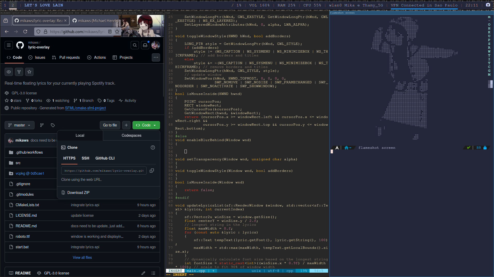

# 🛠️ mikaws/dotfiles

Welcome to my personal dotfiles repository! This collection contains the configuration files and scripts I use to set up and maintain my Arch Linux environment. It's tailored for efficiency, aesthetics, and a streamlined workflow.

And yes, I love lain! :)

## 📦 Features

- ⚙️ **i3** – Tiling window manager with custom keybindings and workspace rules.
- 📋 **Flameshot** – Configured for quick screenshot capture with keyboard shortcuts.
- 🖥️ **Kitty** – Fast, GPU-based terminal with personalized theme and layout.
- 🧾 **Neofetch** – Displays system info on terminal launch.
- 📐 **Polybar** – Status bar with workspace, time, and system monitoring modules.
- 📝 **Neovim (nvim)** – Fully configured with plugins, LSP support, and aesthetic themes.

## 📁 Repository Structure

- **.config/**: Configuration files for various applications and tools.
- **.scripts/**: Custom scripts to automate tasks and enhance productivity.
- **images/**: Visuals showcasing my setup, including the `arch_ss.png` screenshot above.

## 🚀 Features

- **Minimalist Arch Linux Setup**: A clean and efficient environment optimized for daily use.
- **Custom Scripts**: Automations to handle routine tasks and system management.
- **Personalized Configurations**: Tweaked settings for a personalized user experience.
